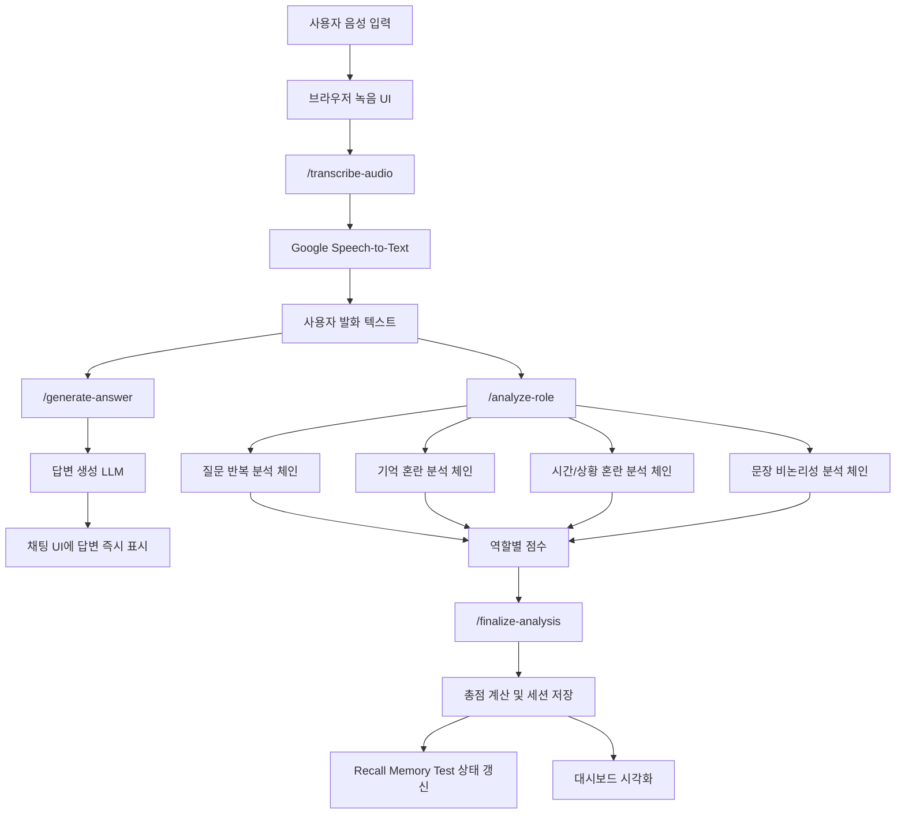

# 인지 위험도 모니터링 시스템

음성 대화를 기반으로 사용자의 언어 특징을 분석하고, 인지 저하 위험 신호를 시각화하는 캡스톤디자인 프로젝트입니다.  
본 시스템은 음성 입력, STT, LLM 응답 생성, 역할별 위험도 분석, Recall Memory Test, 세션 누적 기록, 대시보드 시각화를 하나의 흐름으로 통합하여 구현했습니다.

---

## 1. 프로젝트 개요

본 프로젝트는 사용자의 일상 대화를 음성으로 입력받아 텍스트로 변환한 뒤, 언어적 특징을 분석하여 인지 위험도를 정량적으로 추정하는 시스템입니다.

기존 치매 및 인지 저하 검사는 병원 방문 이후에 이루어지는 경우가 많고, 정적 설문이나 단발성 검사에 의존하는 한계가 있습니다. 이에 따라 본 프로젝트는 다음과 같은 방향을 목표로 합니다.

- 일상적인 대화만으로 위험 신호를 탐지할 수 있는 보조 시스템 구현
- 질문 반복, 기억 혼란, 시간·상황 혼란, 문장 비논리성과 같은 언어 특징 정량화
- 대화형 인터페이스와 실시간 대시보드를 통한 직관적인 결과 제공
- 반복 대화를 통한 세션 누적 분석 및 추세 확인

본 시스템은 의료 진단 도구가 아니라, 인지 위험 징후를 조기에 관찰하기 위한 보조형 모니터링 시스템입니다.

---

## 2. 개발 배경 및 필요성

인지 저하는 초기 단계에서 명확한 증상이 드러나지 않더라도 언어 사용 패턴에서 징후가 관찰될 수 있습니다. 예를 들어 다음과 같은 현상이 반복적으로 나타날 수 있습니다.

- 이미 답을 들은 질문을 다시 묻는 질문 반복
- 최근 정보를 바로 떠올리지 못하는 기억 혼란 표현
- 시간, 일정, 날짜, 순서를 혼동하는 시간·상황 혼란
- 문장 연결이 끊기거나 맥락이 불안정해지는 비논리적 발화

이러한 징후를 일상 대화 수준에서 관찰하고 시각화할 수 있다면, 조기 상담 또는 추가 검사의 필요성을 판단하는 데 도움을 줄 수 있습니다.

---

## 3. 프로젝트 목표

- 한국어 음성 입력을 안정적으로 텍스트로 변환한다.
- 사용자 질문에 대해 자연스럽고 짧은 응답을 생성한다.
- 인지 위험과 관련된 언어 특징을 역할별로 분리 분석한다.
- 분석 결과를 점수화하고 누적 추세를 시각화한다.
- Recall Memory Test를 통해 단기 기억 확인 요소를 보완한다.
- 같은 네트워크의 다른 PC에서도 접속 가능한 로컬 서버 형태로 운용한다.

---

## 4. 주요 기능

- 음성 녹음 및 업로드
- Google Speech-to-Text 기반 한국어 음성 인식
- LLM 기반 사용자 질문 응답 생성
- 역할별 위험도 분석
  - 질문 반복
  - 기억 혼란
  - 시간/상황 혼란
  - 문장 비논리성
- 역할별 점수 도착 즉시 그래프 및 분석 카드 반영
- 세션별 점수 이력, 평균, 최근 5회 평균, 추세 계산
- Recall Memory Test 자동 진행
- 분석 실패 결과의 점수 반영 제외 처리
- 채팅 기록 클릭 시 해당 시점 분석 결과 재조회

---

## 5. 시스템 전체 구조



### 핵심 구조 요약

- 프론트엔드는 음성을 녹음하고, 서버에 오디오를 전송합니다.
- 서버는 Google STT로 음성을 텍스트로 변환합니다.
- 답변 생성과 위험도 분석은 분리되어 동작합니다.
- 사용자는 답변을 먼저 확인할 수 있고, 분석 점수는 뒤에서 순차 반영됩니다.
- 역할별 분석 점수는 각각 독립적으로 계산되며, 최종 단계에서 합산됩니다.
- 세션 단위로 기록이 누적되어 평균, 최근 평균, 추세를 계산합니다.

---

## 6. 상세 동작 흐름

### 6.1 음성 입력 및 STT 처리

1. 사용자가 브라우저에서 녹음을 시작합니다.
2. 녹음 종료 후 음성 파일이 `/transcribe-audio`로 전송됩니다.
3. 서버는 업로드 파일을 `uploads/`에 임시 저장합니다.
4. Google Speech-to-Text API가 `ko-KR` 설정으로 음성을 텍스트로 변환합니다.
5. 변환된 텍스트가 사용자 발화로 프론트엔드에 반환됩니다.

### 6.2 답변 생성 단계

1. 프론트엔드는 사용자 발화를 `/generate-answer`로 전달합니다.
2. 답변 생성용 LLM이 사용자의 질문에 대한 짧고 직접적인 답변을 생성합니다.
3. 이 답변은 분석 완료를 기다리지 않고 먼저 채팅 화면에 표시됩니다.

이 구조를 통해 사용자는 분석이 끝나기 전에 대화 응답을 먼저 확인할 수 있으며, 체감 응답 속도가 향상됩니다.

### 6.3 역할별 위험도 분석 단계

답변 표시 이후, 프론트엔드는 동일한 사용자 발화를 역할별 분석 엔드포인트로 전달합니다.

- 질문 반복 분석
- 기억 혼란 분석
- 시간/상황 혼란 분석
- 문장 비논리성 분석

각 분석은 독립된 역할 기반 체인으로 실행되며, 결과가 도착할 때마다 다음이 즉시 반영됩니다.

- 언어 특징 점수 바
- 레이더 차트
- 현재 분석 카드
- 단계 상태 문구

즉, 전체 점수를 한 번에 보여주는 구조가 아니라, 분석 요소가 하나씩 확정될 때마다 대시보드가 점진적으로 업데이트됩니다.

### 6.4 최종 점수 확정 단계

역할별 점수가 모두 수집되면 `/finalize-analysis`가 호출됩니다.

이 단계에서는 다음이 수행됩니다.

- 역할별 점수 정규화
- 총점 계산
- 판정 생성
- 근거 문장 정리
- 점수 반영 여부 결정
- 세션 이력 저장
- 평균, 최근 평균, 추세 갱신

### 6.5 Recall Memory Test 진행 방식

Recall Memory Test는 대화 도중 자동으로 진행됩니다.

- 사용자 발화 수가 3회, 6회, 9회처럼 3의 배수에 도달하면 기억 단어를 하나 제시합니다.
- 다음 대화 차례에서 방금 제시한 기억 단어를 다시 물어봅니다.
- 사용자의 답변에 해당 단어가 포함되면 정답, 아니면 오답으로 기록합니다.
- Recall 상태는 별도 카드로 시각화됩니다.

### 6.6 세션 누적 및 재조회

시스템은 세션 ID 기준으로 다음 데이터를 메모리에 저장합니다.

- 대화 히스토리
- 턴별 분석 결과
- 점수 히스토리
- Recall Memory Test 상태

또한 채팅 기록을 클릭하면 해당 턴의 분석 결과를 다시 오른쪽 분석 패널에 표시할 수 있습니다.

---

## 7. 역할별 분석 구조

본 프로젝트는 분석을 하나의 거대한 프롬프트로 처리하지 않고, 역할별 체인으로 분리하여 계산합니다.

### 7.1 질문 반복

- 최근 사용자 질문들과 현재 질문을 비교합니다.
- 유사 표현, 동일 의미의 재질문, 직전 답변 직후 반복 여부를 중점적으로 봅니다.

### 7.2 기억 혼란

- “기억이 안 나”, “까먹었다”, “잘 모르겠다”와 같이 기억 회상 어려움을 나타내는 표현을 분석합니다.

### 7.3 시간/상황 혼란

- 날짜, 시간, 일정, 수업, 회의 등의 시간·상황 관련 표현을 이해하지 못하거나 혼동하는지 분석합니다.

### 7.4 문장 비논리성

- 문장 간 연결이 불안정한지
- 주제가 급격히 흔들리는지
- 발화 전체가 비논리적으로 들리는지를 분석합니다.

이처럼 역할을 분리하면 특정 요소만 과하게 반영되는 현상을 줄이고, 각 특징을 독립적으로 해석할 수 있습니다.

---

## 8. 점수 산정 방식

### 8.1 항목별 배점

| 분석 항목 | 설명 | 점수 범위 |
| --- | --- | --- |
| 질문 반복 | 동일하거나 매우 유사한 질문의 재등장 | 0 ~ 25 |
| 기억 혼란 | 최근 정보 회상 실패, 기억 공백 표현 | 0 ~ 25 |
| 시간/상황 혼란 | 시간, 날짜, 일정, 현재 상황 혼동 | 0 ~ 30 |
| 문장 비논리성 | 문장 연결성 저하, 맥락 불안정 | 0 ~ 20 |

### 8.2 총점 계산

총점은 아래와 같이 계산됩니다.

```text
총점 = 질문 반복 + 기억 혼란 + 시간/상황 혼란 + 문장 비논리성
```

총점 범위는 0점에서 100점입니다.

### 8.3 판정 기준

- 0 ~ 19점: 정상
- 20점 이상: 의심
- 분석 실패 또는 정보 부족: 판단 어려움

### 8.4 위험도 라벨 기준

대시보드에는 총점 기준으로 보다 세분화된 위험도 라벨도 함께 표시됩니다.

- 0 ~ 19점: `Normal`
- 20 ~ 39점: `Low Risk`
- 40 ~ 59점: `Moderate Risk`
- 60 ~ 79점: `High Risk`
- 80 ~ 100점: `Very High Risk`

### 8.5 점수 반영 제외 기준

다음과 같은 경우에는 0점을 정상 결과로 보지 않고 통계에서 제외합니다.

- `판단 어려움`
- 총점 0점
- 네 가지 세부 점수가 모두 0점

예를 들어 입력이 너무 짧거나, STT 실패로 분석 자체가 불가능한 경우에는 평균 점수와 추세 계산에 반영하지 않습니다.

---

## 9. UI 및 시각화 구성

프론트엔드는 사용자가 분석 흐름을 직관적으로 이해할 수 있도록 다음과 같이 구성했습니다.

- 실시간 처리 단계 표시
  - 음성 수신
  - 음성 인식
  - 답변 생성
  - 위험도 분석
  - 화면 반영
- 채팅형 대화 인터페이스
- 누적 상태 카드
- 전체 평균 / 최근 5회 평균 / 최근 점수 / 추세 카드
- 누적 위험도 게이지
- 시간별 점수 추이 선 그래프
- 언어 특징 점수 분해 막대
- 언어 특징 레이더 차트
- AI 분석 신뢰도 카드
- Recall Memory Test 카드

또한 녹음 중에는 채팅 패널 내부 배경에 음성 시각화 애니메이션이 나타나도록 하여, 현재 상태를 시각적으로 전달하도록 구성했습니다.

---

## 10. 주요 API 흐름

| 엔드포인트 | 역할 |
| --- | --- |
| `/health` | 서버 상태 확인 |
| `/transcribe-audio` | 음성 파일 업로드 및 STT 수행 |
| `/generate-answer` | 답변 생성 |
| `/analyze-role` | 역할별 분석 수행 |
| `/finalize-analysis` | 최종 점수 및 기록 저장 |
| `/score-history` | 세션별 점수 및 턴 기록 조회 |
| `/reset-history` | 세션 기록 초기화 |

---

## 11. 프로젝트 구조

```text
ncai-dementia-risk-monitor/
├─ app.py
├─ requirements.txt
├─ README.md
├─ start_server.bat
├─ lint.bat
├─ format.bat
├─ package.json
├─ static/
│  ├─ script.js
│  └─ style.css
├─ templates/
│  └─ index.html
├─ uploads/
├─ models/
└─ ncai_app/
   ├─ __init__.py
   ├─ common.py
   ├─ config.py
   ├─ runtime.py
   ├─ llm_service.py
   ├─ analysis_service.py
   ├─ history_service.py
   └─ routes.py
```

### 파일별 역할

- `app.py`: Flask 앱 생성 및 서버 실행
- `ncai_app/config.py`: 경로, 환경변수, 프롬프트, 상수 관리
- `ncai_app/llm_service.py`: STT, 로컬/API LLM 연동
- `ncai_app/analysis_service.py`: 역할별 분석, 점수 산정, 근거 정리
- `ncai_app/history_service.py`: 세션, 점수 이력, Recall 상태 관리
- `ncai_app/routes.py`: API 라우트 정의
- `static/script.js`: 프론트엔드 동작 및 차트 갱신
- `static/style.css`: UI 스타일 및 인터랙션
- `templates/index.html`: 메인 화면

---

## 12. 사용 기술

### Backend

- Python
- Flask
- Waitress

### AI / NLP

- LangChain
- LlamaCpp
- EXAONE 3.5 7.8B Instruct GGUF

### Speech

- Google Cloud Speech-to-Text

### Frontend

- HTML
- CSS
- JavaScript
- Chart.js
- MediaRecorder API

---

## 13. 실행 방법

### 13.1 의존성 설치

```bash
pip install -r requirements.txt
```

프론트엔드 포맷/검사용 도구를 사용할 경우:

```bash
npm install
```

### 13.2 준비 파일

실행 전에 아래 항목이 필요합니다.

- Google Cloud Speech-to-Text 서비스 계정 키 파일
- `models/` 폴더 내부 GGUF 모델 파일

기본 모델 경로:

```text
models/EXAONE-3.5-7.8B-Instruct-Q8_0.gguf
```

### 13.3 서버 실행

```bash
python app.py
```

또는 Windows에서는:

```bash
start_server.bat
```

### 13.4 접속 주소

- 같은 PC에서 접속: `http://127.0.0.1:5000`
- 같은 네트워크의 다른 PC에서 접속: `http://서버PC_IP:5000`

예시:

```text
http://192.168.0.15:5000
```

### 13.5 코드 검증

```bash
lint.bat
```

또는:

```bash
npm run lint
```

---

## 14. 확장 요소

현재 구현은 로컬 GGUF 모델 기반 실행을 기본으로 사용합니다.  
추가적으로 OpenAI 호환 API를 사용할 수 있도록 설계되어 있어, 향후 운영 환경에 따라 다음과 같은 확장이 가능합니다.

- 로컬 모델 기반 분석
- 외부 LLM API 기반 분석
- 공개 서버형 배포 구조로 확장
- 영구 DB 저장 구조 추가

캡스톤 구현 기준에서는 로컬 실행 구조를 중심으로 시연할 수 있도록 정리했습니다.

---

## 15. 기대 효과

- 일상 대화 기반 인지 위험 징후 탐지 가능성 제시
- 단발성 검사보다 자연스러운 모니터링 방식 제안
- 언어 특징을 수치와 그래프로 보여주는 설명 가능한 구조 구현
- 음성 입력부터 분석, 기록, 시각화까지 하나의 서비스 흐름으로 통합

---

## 16. 한계점 및 향후 개선 방향

### 한계점

- 본 시스템은 의료 진단 도구가 아니며 보조 모니터링 목적입니다.
- 실제 임상 데이터 기반 검증이 충분하지 않습니다.
- 세션 저장은 현재 메모리 기반이므로 서버 재시작 시 기록이 초기화됩니다.
- LLM 출력 품질은 프롬프트와 모델 상태에 영향을 받을 수 있습니다.

### 향후 개선 방향

- SQLite 또는 DB 기반 세션 영구 저장
- 실제 고령층 및 임상 데이터셋 기반 평가
- 감정 분석, 음성 특징 분석, 표정 분석과의 융합
- 전문가 피드백 기반 점수 체계 고도화
- 리포트/PDF 출력 기능 추가

---

## 17. 결론

본 프로젝트는 음성 인식, 대화형 AI, 언어 특징 분석, 세션 기반 추적, 시각화 대시보드를 결합하여 인지 위험도 모니터링 시스템을 구현한 캡스톤디자인 결과물입니다.

단순한 챗봇이 아니라, 사용자의 발화를 분석 가능한 데이터로 전환하고 이를 점수와 그래프로 구조화하여 보여준다는 점에서 의미가 있습니다. 또한 답변 생성과 분석을 분리하고, 역할별 체인 구조를 도입하여 시스템의 응답성과 해석 가능성을 동시에 확보하고자 했습니다.
